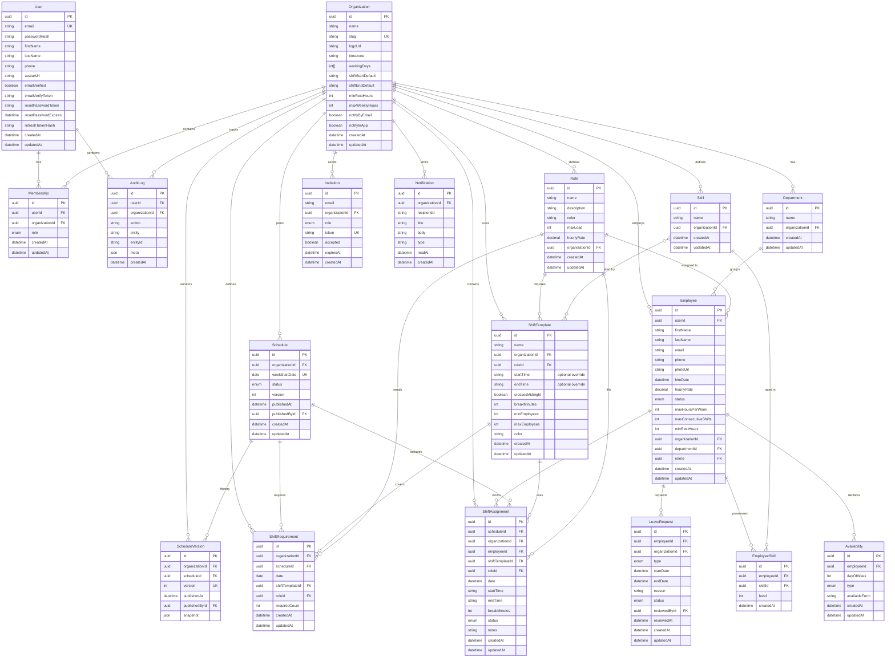

# ShiftFlow Data Model

## ER Diagram

## Business Rules

1. **No overlapping shifts (`OVERLAP`, ERROR)**: Absolute employee shift intervals cannot overlap; touching endpoints are allowed.
2. **Minimum rest (`INSUFFICIENT_REST`, ERROR)**: Non-overlapping neighbouring shifts must be separated by the employee's minimum rest or the organization default.
3. **Weekly hours (`OVERTIME`, WARNING)**: Paid hours (duration less break minutes) above the employee's limit or `Organization.maxWeeklyHours` are returned as a warning and still saved.
4. **Inactive employee (`EMPLOYEE_INACTIVE`, ERROR)**: Dismissed employees cannot receive assignments.
5. **Leave (`ON_LEAVE`, ERROR)**: Approved leave windows and `VACATION`/`SICK` employee status block assignments.
6. **Role matching (`ROLE_MISMATCH`, ERROR)**: A supplied assignment role must match the employee role.
7. **Skill matching (`SKILL_MISMATCH`, ERROR)**: Required template skills must be a subset of employee skills.
8. **Availability (`UNAVAILABLE`, ERROR)**: Unavailable weekdays block assignments.
9. **Availability-after (`AVAILABLE_AFTER_CONFLICT`, WARNING)**: Assignments beginning before an `AVAILABLE_AFTER` time are saved with a warning so the UI can explain the conflict.
10. **Consecutive days (`MAX_CONSECUTIVE_SHIFTS`, WARNING)**: A run of calendar days worked above the employee limit is returned as a warning.
11. **Night shifts**: Template and assignment intervals cross midnight when `endTime <= startTime` (for example 23:00–08:00).
12. **Schedule history**: Publishing increments the schedule version and stores the serialized assignment snapshot in `ScheduleVersion`.
13. **Catalog name uniqueness**: `Department`, `Role`, `Skill`, and `ShiftTemplate` names are unique within an organization (`@@unique([name, organizationId])`) and stored trimmed.
14. **Catalog scoping and permissions**: catalog reads are scoped to the organization from the auth context and available to any member; create/update/delete are restricted to `OWNER`/`MANAGER` and recorded in `AuditLog`.
15. **Employee email uniqueness**: `Employee.email` is unique within an organization (`@@unique([email, organizationId])`) and stored normalized (trimmed, lower-cased).
16. **One availability row per day**: `Availability` has at most one record per employee per weekday (`@@unique([employeeId, dayOfWeek])`); `availableFrom` (`HH:MM`) is required for `AVAILABLE_AFTER` and cleared for the other types.
17. **Leave overlap**: A new `LeaveRequest` cannot overlap an existing `PENDING` or `APPROVED` request for the same employee, and `endDate >= startDate`.
18. **Leave review**: Only `PENDING` requests can be approved or rejected, and only by `OWNER`/`MANAGER`; the reviewer and timestamp are stored and the action written to `AuditLog`. Approving an active `VACATION`/`SICK` request sets the employee status accordingly.
19. **Employee self-service**: an `EMPLOYEE` may edit only the availability of, and create leave requests for, the employee profile linked to their own user; `OWNER`/`MANAGER` may act on any employee in the organization.
20. **Dismissal vs deletion**: `dismissEmployee` is a soft delete that sets `status = DISMISSED`; `deleteEmployee` removes the record.
21. **Draft before publish**: Schedules must be in `DRAFT` status before they can be `PUBLISHED`. Published schedules are immutable.

## Enums

### MembershipRole
`OWNER` | `MANAGER` | `SUPERVISOR` | `EMPLOYEE`

### ScheduleStatus
`DRAFT` | `PUBLISHED` | `ARCHIVED`

### ShiftAssignmentStatus
`ASSIGNED` | `CONFIRMED` | `DECLINED` | `SWAPPED` | `NO_SHOW` | `COMPLETED`

### EmployeeStatus
`WORKING` | `VACATION` | `SICK` | `DISMISSED`

### AvailabilityType
`UNAVAILABLE` | `AVAILABLE` | `AVAILABLE_AFTER`

### LeaveType
`VACATION` | `DAY_OFF` | `SICK` | `UNPAID` | `OTHER`

### LeaveStatus
`PENDING` | `APPROVED` | `REJECTED` | `CANCELLED`
