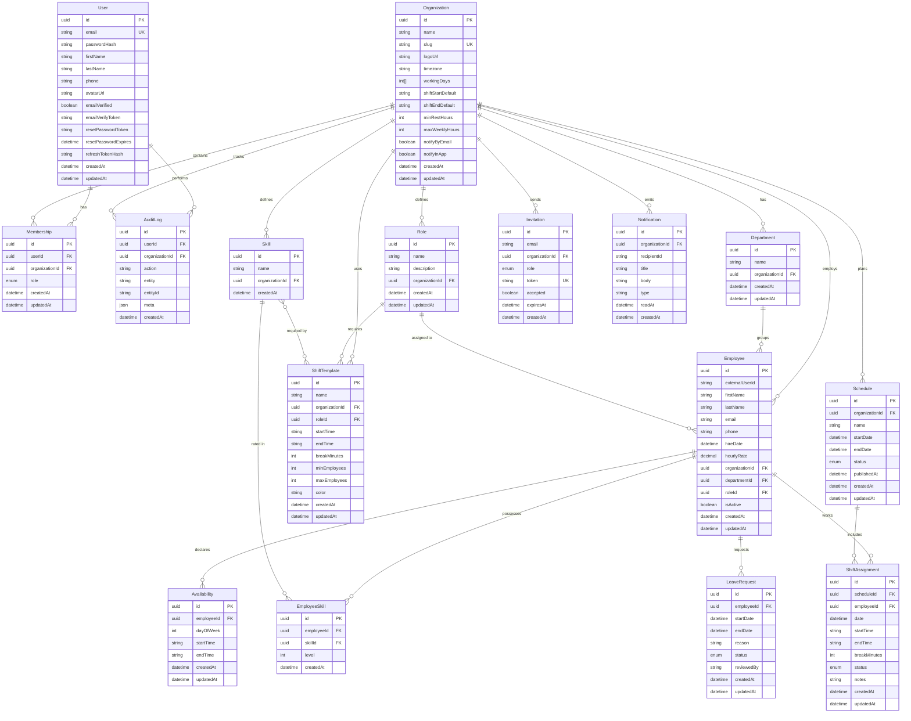

# ShiftFlow Data Model

## ER Diagram

## Business Rules

1. **No overlapping shifts**: An employee cannot be assigned to two shifts that overlap in time on the same day.
2. **Weekly hour limit**: Total assigned hours per employee per week must not exceed `Organization.maxWeeklyHours` (default 40).
3. **Minimum rest between shifts**: There must be at least `Organization.minRestHours` (default 8) hours between the end of one shift and the start of the next.
4. **Respect availability**: Shifts can only be assigned during an employee's declared availability windows.
5. **Respect leave requests**: Employees with approved leave requests cannot be assigned shifts during their leave period.
6. **Role matching**: If a `ShiftTemplate` specifies a required `Role`, only employees with that role can be assigned.
7. **Skill matching**: If a `ShiftTemplate` lists required `Skills`, assigned employees must possess those skills.
8. **Draft before publish**: Schedules must be in `DRAFT` status before they can be `PUBLISHED`. Published schedules are immutable (archive and create new).

## Enums

### MembershipRole
`OWNER` | `MANAGER` | `SUPERVISOR` | `EMPLOYEE`

### ScheduleStatus
`DRAFT` | `PUBLISHED` | `ARCHIVED`

### ShiftAssignmentStatus
`ASSIGNED` | `CONFIRMED` | `DECLINED` | `SWAPPED` | `NO_SHOW` | `COMPLETED`

### LeaveRequestStatus
`PENDING` | `APPROVED` | `REJECTED` | `CANCELLED`
